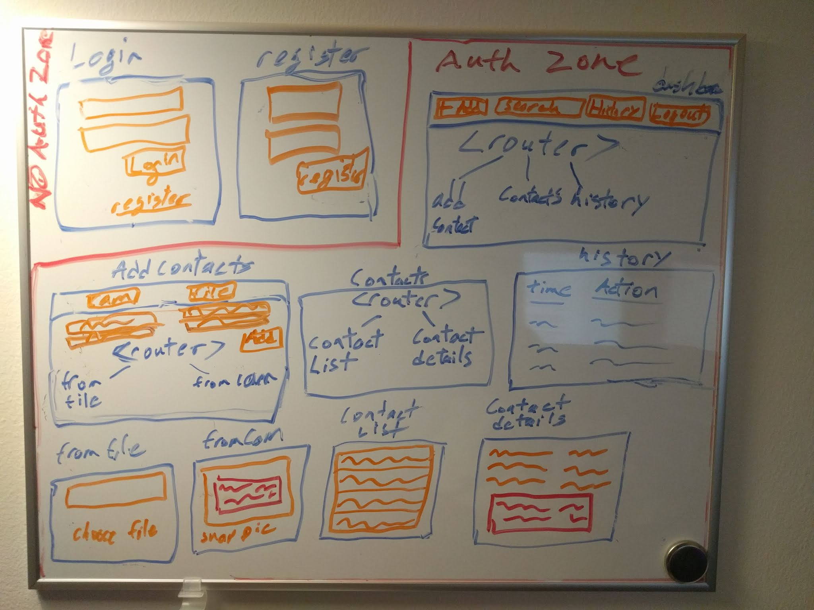

# BusinessCardManager

This project was generated with [Angular CLI](https://github.com/angular/angular-cli) version 7.0.6.

## Project Planning

### Structure
* **app/**
  * app module :heavy_check_mark:
  * app component :heavy_check_mark:
  * app-routing module :construction:
  * **auth/**
    * auth guard :heavy_check_mark:
    * auth service :heavy_check_mark:
    * role guard
    * **login/**
      * login component :heavy_check_mark:
    * **register/**
      * register component
  * **core/**
    * core module :construction:
    * ~~acquire-image service~~
    * contacts service
    * history service
    * ocr service :construction:
  * **dashboard/**
    * dashboard module :construction:
    * dashboard-routing module :construction:
    * dashboard component :construction:
    * **add-contact/**
      * add-contact component :construction:
      * **from-camera/**
        * from-camera component :construction:
      * **from-file/**
        * from-file component
    * **contacts/**
      * contacts module :construction:
      * contacts-routing module :construction:
      * **contact-list/**
        * contact-list component :construction:
      * **contact-details/**
        * contact-details component :construction:
    * **history/**
      * history component :construction:
  * **shared/**
    * shared module :heavy_check_mark:
    * **models/**
      * business-card class :construction:

### Doodle

